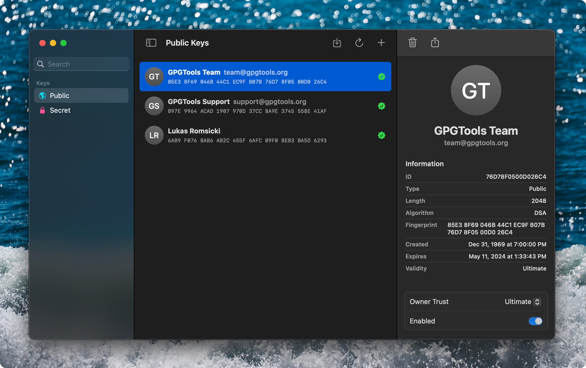
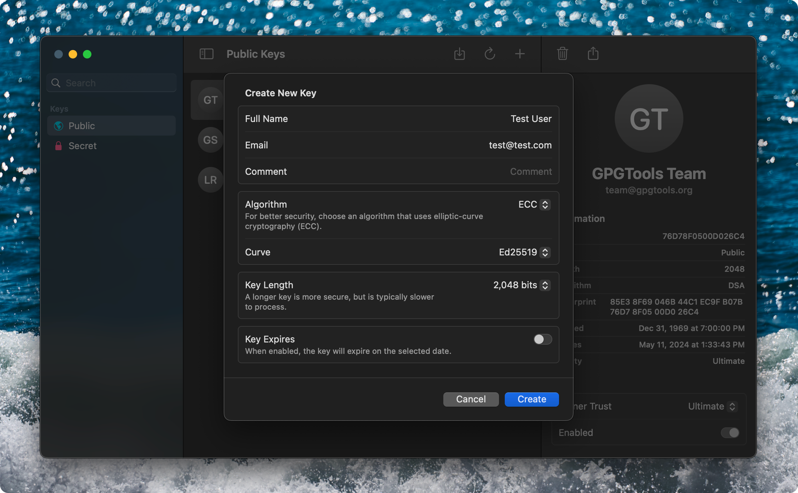

<h1 align="center">
  
   
  Hanko 
   
</h1>

<h4 align="center">A next-generation GPG key manager with hardware security key support.</h4>

  
  
  
  

  

## About

⚠️ **Hanko is a work-in-progress. Contributions are welcome!**

Hanko _[HAHN-ko]_, named for the personalized Japanese stamp often used in lieu of handwritten signatures, is a modern GPG key manager that makes it easy to create, edit, and organize GPG keys. Hanko aims to be a modern alternative to GPG Keychain from GPGTools and is written in Swift and SwiftUI.

### Key Features

- Human-friendly user interface that makes it easy for anyone to manage keys.
- Support for managing and configuring hardware security keys such as the YubiKey.

Hanko uses [gpgme](https://gnupg.org/software/gpgme/index.html) under the hood and does not interact with the `gpg` command line tool directly.

  

## Contributions

Hanko is currently a work-in-progress, but any and all contributions are welcome.

## License

Hanko is released under the [GPL-3.0 License](LICENSE) unless otherwise noted.
